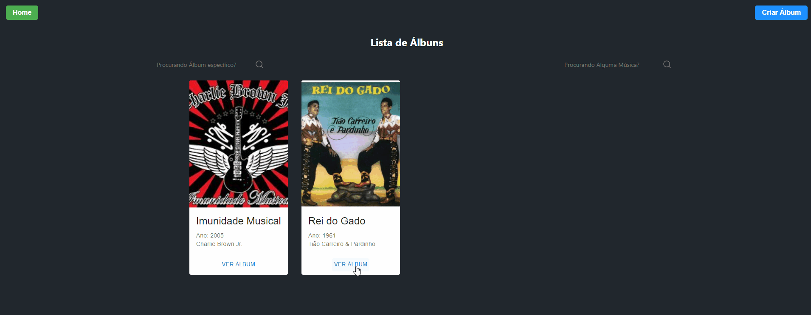
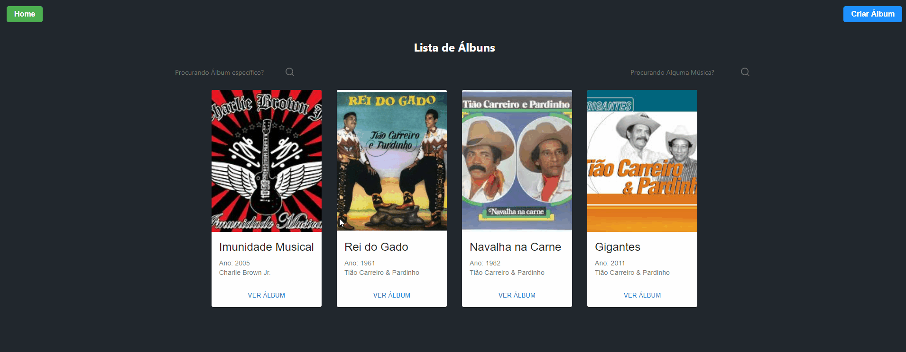

# Getting Started with Create React App

This project was bootstrapped with [Create React App](https://github.com/facebook/create-react-app).

## Tabela de Conteúdos
================================================

- [Sobre](#sobre-discografia-react)
- [Utilização](#como-utilizar-o-projeto)
- [Funcionamento](#funcionamento)
## Sobre Discografia-React

Discografia-React é um projeto criado para ser o FrontEnd da API <a href="https://github.com/Borguezani/discografia-php" target='_blank'>Discografia-PHP</a>. Fazendo requisições para os endpoints da API.

## Como Utilizar o Projeto

``IMPORTANTE JÁ TER O PROJETO BACKEND INSTALADO E CONFIGURADO EM SUA MÁQUINA!``
<a href="https://github.com/Borguezani/discografia-php" target='_blank'>DISCOGRAFIA-PHP</a>
-
- O primeiro passo é instalar o <a href="https://nodejs.org/en" target='_blank'>Node.JS</a>
- Em uma pasta abra o terminal e execute os seguintes comandos:
```
git clone https://github.com/Borguezani/discografia-react.git
cd .\discografia-react\
npm install
npm run start
```
- O seu projeto já vai estar rodando na porta http://localhost:3000/
- Se preferir pode acessar o <a href="https://discografia-react.vercel.app/" target='_blank'>Vercel App</a>
- Lembre-se o servidor com a API deve estar rodando para a aplicação funcionar corretamente.

## Funcionamento
#### Funcionamento da criação de álbums

#### Funcionamento da criação de músicas

#### Funcionamento dos campos de pesquisa

#### Funcionamento do Delete

